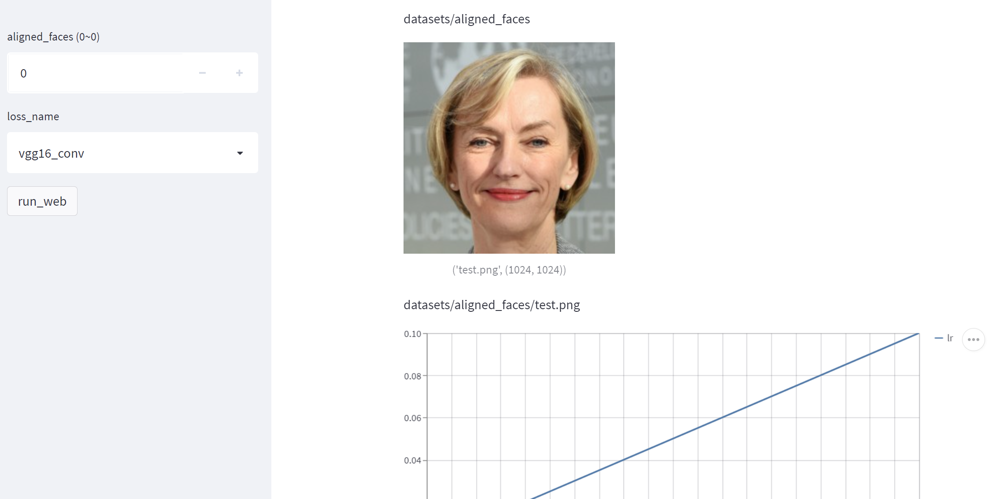

# HRInversion

A minimal PyTorch implementation of VGG conv-based perceptual loss (not the VGG relu-based perceptual loss). 

# Install

```bash
# pip
pip install git+https://github.com/PeterouZh/HRInversion.git

# local
git clone https://github.com/PeterouZh/HRInversion.git
pip install -e HRInversion

```

# Usage

```python
import torch
import torch.nn.functional as F
from hrinversion import VGG16ConvLoss

bs = 1
# Note that the shortest edge of the image must be larger than 32 pixels.
img_size = 1024

# Dummy data
target = (torch.rand(bs, 3, img_size, img_size).cuda() - 0.5) * 2  # [-1, 1]
pred = (torch.rand(bs, 3, img_size, img_size).cuda() - 0.5) * 2  # [-1, 1]
pred.requires_grad_(True)

# VGG conv-based perceptual loss
percep_loss = VGG16ConvLoss().cuda().requires_grad_(False)

# high-level perceptual loss: d_h
# percep_loss = VGG16ConvLoss(fea_dict={'features_2': 0., 'features_7': 0., 'features_14': 0.,
#                                       'features_21': 0.0002, 'features_28': 0.0005,
#                                       }).cuda().requires_grad_(False)

fea_target = percep_loss(target)
fea_pred = percep_loss(pred)

loss = F.mse_loss(fea_pred, fea_target, reduction='sum') / bs # normalized by batch size
loss.backward()
```


# Demo videos

<details open>
<summary>
  Inversion (please zoom in to see artifacts. )
</summary>
  
https://user-images.githubusercontent.com/26176709/178883567-032c562c-b529-4eb4-af3d-5f0013d87db6.mp4
</details>

<details open>
<summary>
  LSO for ukiyo_e
</summary>
  
https://user-images.githubusercontent.com/26176709/178882562-a59990db-f01c-43e5-8600-bbbd7e9eac4b.mp4
</details>

<details open>
<summary>
  LSO for disney
</summary>
  
https://user-images.githubusercontent.com/26176709/178883223-a0498706-ed5c-4413-9412-8a63f99ae305.mp4
</details>

<details open>
<summary>
  Panorama
</summary>
  
https://user-images.githubusercontent.com/26176709/178884422-d1bcd97a-14f3-4cb1-a5c2-b1a21cdad441.mp4
</details>

# A web demo using hrinversion

<!-- https://user-images.githubusercontent.com/26176709/177040601-17c9581c-eac7-498c-b486-a7cbcdc417c2.mp4 -->

- Prepare models
```bash
# Download StyleGAN2 models
wget https://nvlabs-fi-cdn.nvidia.com/stylegan2-ada-pytorch/pretrained/transfer-learning-source-nets/ffhq-res1024-mirror-stylegan2-noaug.pkl -P datasets/pretrained/
wget https://nvlabs-fi-cdn.nvidia.com/stylegan2-ada-pytorch/pretrained/metrics/vgg16.pt -P datasets/pretrained/
  
```
```text
tree datasets/

datasets/
├── aligned_faces
│   └── test.png
└── pretrained
    ├── ffhq-res1024-mirror-stylegan2-noaug.pkl
    └── vgg16.pt
```

- Start a web demo:
```bash
streamlit run --server.port 8501 \
  hrinversion/scripts/projector_web.py -- \
  --cfg_file hrinversion/configs/projector_web.yaml \
  --command projector_web \
  --outdir results/projector_web

```

- (optional) Debug the script with this command:
```bash
python hrinversion/scripts/projector_web.py \
  --cfg_file hrinversion/configs/projector_web.yaml \
  --command projector_web \
  --outdir results/projector_web \
  --debug True

```

- Results




## Stylization

TBD

## Acknowledgments

- stylegan2-ada from [https://github.com/NVlabs/stylegan2-ada-pytorch](https://github.com/NVlabs/stylegan2-ada-pytorch)


